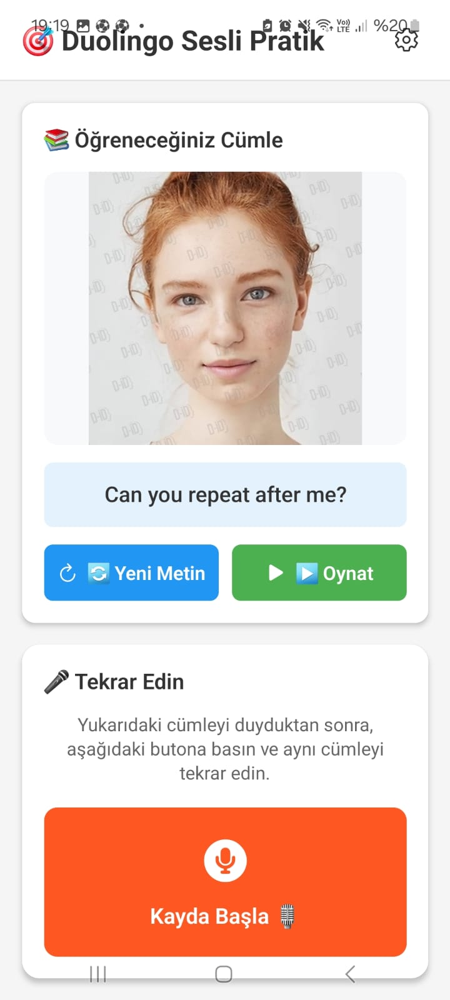

# 🎯 Sesli Pratik Uygulaması

<div align="center">


**AI destekli sesli pratik uygulaması**

[🚀 Özellikler](#-özellikler) • [📱 Kurulum](#-kurulum) • [🎯 Kullanım](#-kullanım)

</div>
## 📸 Ekran Görüntüsü

<div align="center">



</div>
---

## 📸 Ekran Görüntüsü

<div align="center">


</div>

---

## 🌟 Özellikler

### 🎭 D-ID Avatar ile Video (TTS)
- **Hazır İngilizce metinler** ile pratik
- **AI Avatar videoları** - Gerçekçi avatar konuşur
- **Rastgele metin seçimi** - Her seferinde farklı metin
- **ElevenLabs Flash v2.5** modeli ile hızlı ve doğal ses

### 🎤 AssemblyAI STT ile Kayıt
- **AI STT ile kayıt** - AssemblyAI STT
- **Gerçek zamanlı transkripsiyon** geçmişi
- **Metin karşılaştırma** - Doğruluk skorları
- **Ücretsiz tier** - Aylık 5 saat ücretsiz

### 🎨 Modern UI
- **Modern** arayüz
- **Dark/Light Mode** desteği
- **Temiz ve kullanıcı dostu** tasarım

---

## 📱 Kurulum

### Gereksinimler
- Node.js (v16 veya üzeri)
- npm veya yarn
- Expo CLI

### Adımlar

1. **Bağımlılıkları yükleyin**
```bash
cd VoiceAIApp
npm install
```

2. **Uygulamayı başlatın**
```bash
npm start
```

### ⚠️ Önemli Not
Expo Go mikrofon erişimini desteklemez. Ses kaydı için development build gerekir:
```bash
npm install -g eas-cli
eas build --profile development --platform android
eas build --profile development --platform ios
```

---

## 🎯 Kullanım

### 🎭 Avatar Pratik
1. **"🔄 Yeni Metin"** butonuna basın - Rastgele İngilizce metin seçer
2. **"▶️ Oynat"** butonuna basın - D-ID avatar videosunu oluşturur ve oynatır
3. **Videoyu izleyin** ve pratik yapın

### 🎤 Ses Kaydı ve Tekrar
1. **"🎙️ Kayda Başla"** butonuna basın
2. **Konuşun** - Yukarıdaki cümleyi tekrar edin
3. **"⏹️ Kaydı Durdur"** butonuna basın
4. **Sonuç** - Kaydedilen metin aşağıda görünür ve doğruluk skoru gösterilir

---

## 🛠️ Teknolojiler

- **React Native** - Mobil uygulama framework'ü
- **Expo** - Geliştirme platformu
- **TypeScript** - Tip güvenli JavaScript
- **D-ID** - AI destekli avatar TTS (Text-to-Speech)
- **AssemblyAI** - AI STT servisi
- **Expo AV** - Video ve ses işleme

---

## 📁 Proje Yapısı

```
VoiceAIApp/
├── App.tsx                    # Ana uygulama bileşeni
├── services/
│   ├── D-IDService.ts         # D-ID API servisi (TTS)
│   └── AssemblyAIService.ts   # AssemblyAI API servisi (STT)
├── assets/                    # Uygulama varlıkları
└── package.json              # Proje bağımlılıkları
```

---

<div align="center">

**⭐ Bu projeyi beğendiyseniz yıldız vermeyi unutmayın!**

Made with ❤️ by [Batuhan](https://github.com/BlirBatuhan)

</div>
