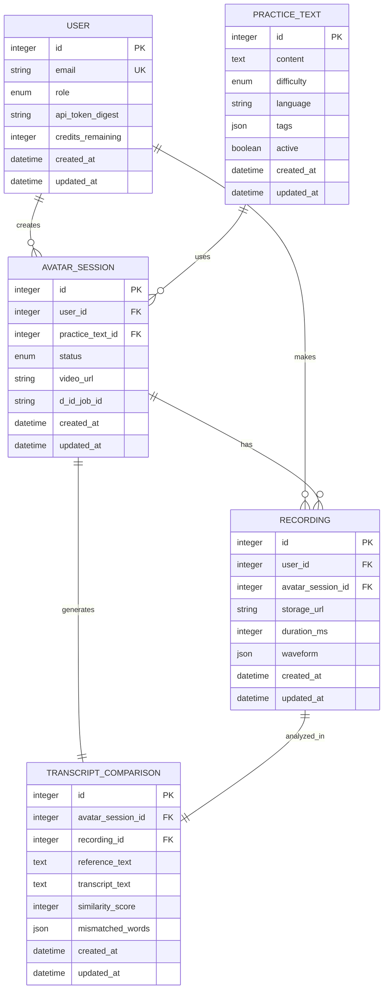
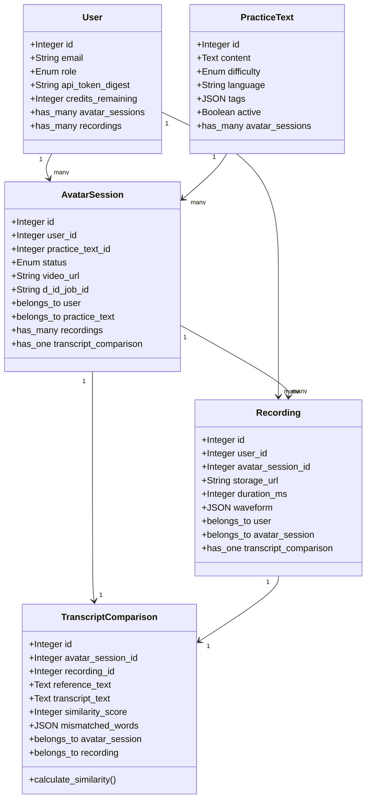
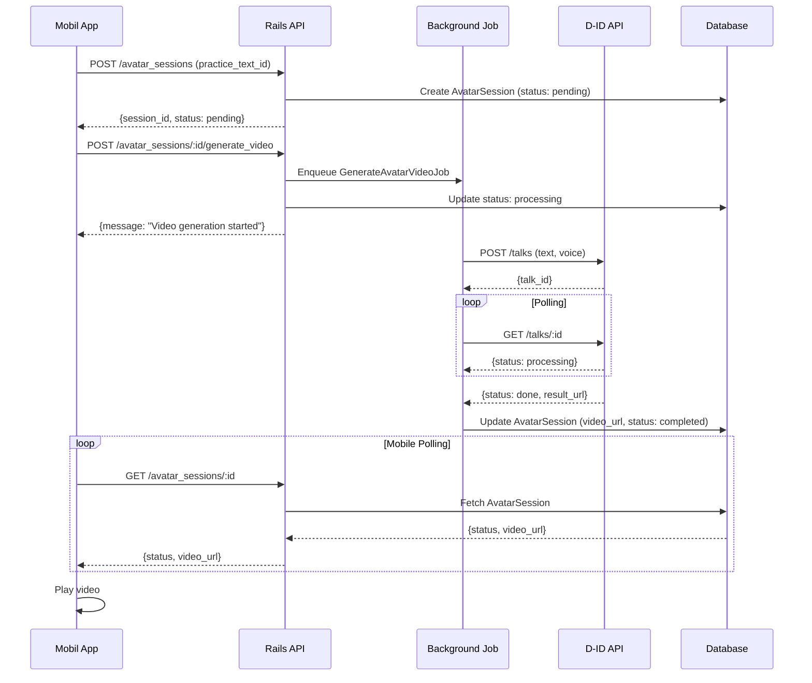
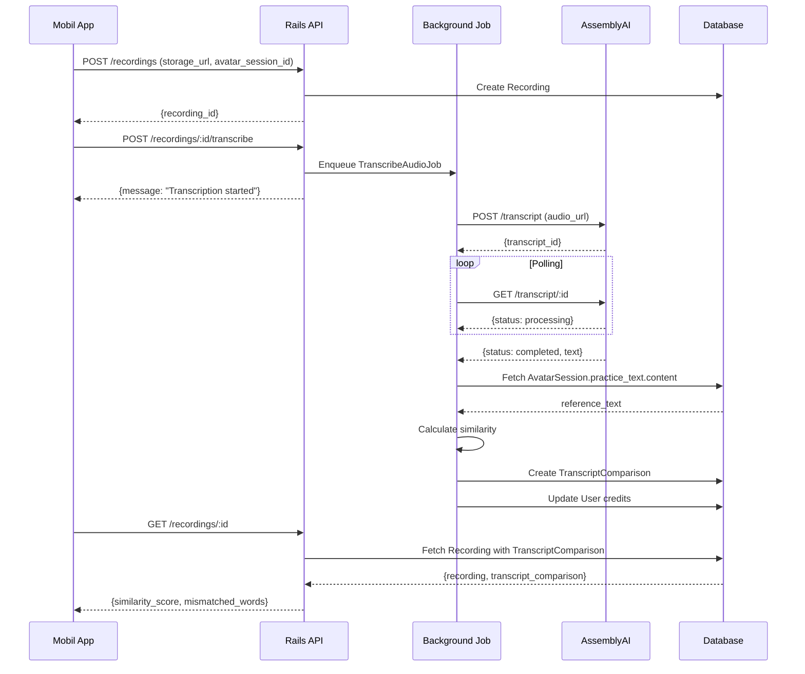
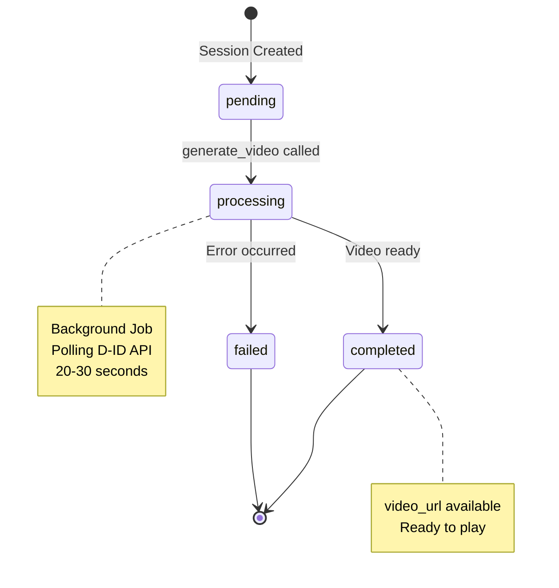
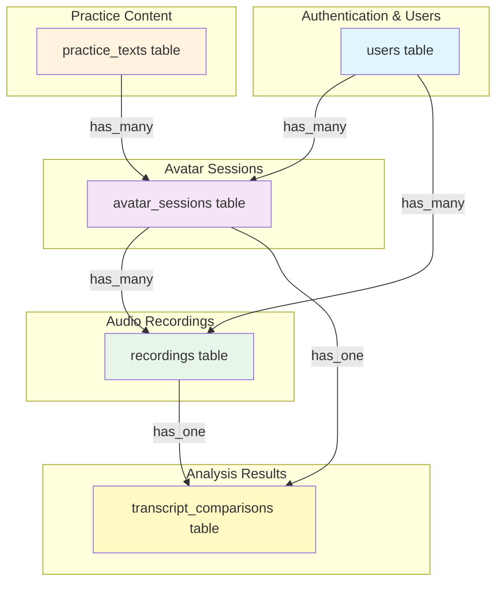

# 🎨 Voice AI - Entity Relationship Diagram

## Mermaid ER Diagram (GitHub destekli)



## Class Diagram



## Sequence Diagram - Video Oluşturma



## Sequence Diagram - Transkript Karşılaştırma



## State Diagram - AvatarSession Status



## Database Schema Diagram



---

## 📊 Model Özeti

| Model | Amaç | İlişkiler | Enum Fields |
|-------|------|-----------|-------------|
| **User** | Kullanıcı yönetimi | 2 has_many | role |
| **PracticeText** | Pratik cümleleri | 1 has_many | difficulty |
| **AvatarSession** | Video oturumları | 2 belongs_to, 1 has_many, 1 has_one | status |
| **Recording** | Ses kayıtları | 2 belongs_to, 1 has_one | - |
| **TranscriptComparison** | Karşılaştırma sonuçları | 2 belongs_to | - |

**Toplam: 5 Model**

---

## 🔗 GitHub'da Görüntüleme

Bu dosyayı GitHub'a push ederseniz, Mermaid diyagramları otomatik olarak render edilir!

```bash
git add .
git commit -m "Add ER diagrams"
git push
```

---

## 🎯 yUML Link (Online)

https://yuml.me/diagram/scruffy/class/draw sayfasına gidin ve yapıştırın:

```
[User]1-*[AvatarSession]
[User]1-*[Recording]
[PracticeText]1-*[AvatarSession]
[AvatarSession]1-*[Recording]
[AvatarSession]1-1[TranscriptComparison]
[Recording]1-1[TranscriptComparison]
```

PNG olarak indirebilirsiniz! 📸

